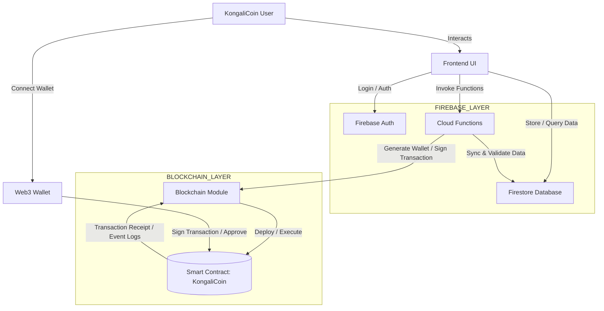

# 🪙 KONGALICOIN – Next Generation Digital Asset  
Official Repository by **@kongali1720**

[](https://kongalicoin.id)


[]()
[]()
[]()
[]()
[]()
[]()
[]()

---

## 🔥 Apa itu **KongaliCoin**?

**KongaliCoin** adalah proyek blockchain digital asset modern yang dibangun oleh **Kong Ali** untuk menghadirkan:
- Kecepatan transaksi tinggi ⚡  
- Transparansi berbasis cloud ☁️  
- Keamanan terdistribusi 🔐  
- Integrasi mudah dengan website, aplikasi, dan wallet 💼

Proyek ini menggunakan teknologi terbaru seperti **Firebase, Cloudflare, JS Modules, dan Web Security Framework** untuk memastikan performa terbaik dan keamanan maksimal.

---

## ✨ Fitur Utama

### 🔐 **Firebase Authentication**
- Login aman (Admin & User)
- Manajemen akun
- Validasi token realtime

### 📡 **Firestore Realtime Database**
- Penyimpanan transaksi
- Wallet tracking
- Market price monitoring

### 🌐 **Hosting Cepat**
- Cloudflare-integrated
- Gzip & Brotli compression
- Zero-downtime deployment

### 🛡 **Security Protection**
- Anti-CSRF
- Anti-XSS
- HTTPS enforced
---

## 🧱 Teknologi yang Digunakan
| Teknologi | Fungsi |
|----------|---------|
| **Firebase** | Auth, Firestore, Hosting |
| **JavaScript ES6** | Frontend logic & API |
| **HTML5 / CSS3** | UI/UX Website |
| **Cloudflare Worker** | API gateway & security |
| **Node.js** | Dev tool & build system |
---

## 📁 Struktur Proyek

```bash
KONGALICOIN
│── public/
│   ├── index.html
│   ├── css/
│   ├── js/
│   │   ├── auth.js
│   │   ├── firebase-config.js
│   │   └── app.js
│── firebase.json
│── .firebaserc
│── README.md
```



### 🧱 Project Structure Overview

```bash

flowchart LR

    A[Frontend (HTML/JS)] --> B[auth.js]
    A --> C[firebase-config.js]
    B --> D[Firebase Auth]
    C --> E[Firestore]
    C --> F[Cloud Functions]
    F --> G[(Smart Contract)]
```


| Layer          | File / Module              | Function                                   |
| -------------- | -------------------------- | ------------------------------------------ |
| **Frontend**   | `index.html`               | Tampilan UI                                |
|                | `auth.js`                  | Login / Register                           |
|                | `firebase-config.js`       | Setup Firebase                             |
|                | `app.js`                   | Logic utama website                        |
| **Firebase**   | Firebase Auth              | Validasi user                              |
|                | Firestore                  | Menyimpan data user & transaksi            |
|                | Cloud Functions            | Backend logic, wallet generator, validator |
| **Blockchain** | Blockchain Module          | Sign Tx, deploy, execute                   |
|                | Smart Contract KongaliCoin | Token logic                                |
| **Wallet**     | MetaMask / Web3 Wallet     | Approve & sign transaksi                   |

```bash
[User]
   |
   v
[Frontend UI]
   |
   |--- Login ---> [Firebase Auth]
   |--- Data  ---> [Firestore]
   |--- Call  ---> [Cloud Functions] ---> [Smart Contract]
                                               ^
                                               |
                                           [Wallet]
```

## 🚀 Cara Menjalankan di Lokal

```bash
npm install -g firebase-tools
firebase login
firebase init
firebase serve
```

### Website akan muncul di:

http://127.0.0.1:5000/


### 🌍 Deployment

Deploy langsung ke Firebase Hosting:

## 🤝 Kontribusi

Kami sangat terbuka terhadap kontribusi dari siapa pun yang ingin mengembangkan **KongaliCoin** menjadi proyek yang lebih kuat, aman, dan bermanfaat bagi banyak orang.

💡 **Cara berkontribusi:**
- Ajukan *Pull Request* untuk penambahan fitur atau perbaikan kode.
- Buka *Issue* jika menemukan bug, error, atau ide baru.
- Diskusikan fitur inovatif yang dapat meningkatkan ekosistem KongaliCoin.

Setiap kontribusi, sekecil apa pun, sangat berarti bagi komunitas ini.  
Mari bersama membangun ekosistem digital yang lebih baik! 🚀


## ❤️ Dibuat Dengan Semangat

Karya ini dibuat dengan penuh dedikasi oleh:

### **👤 Kong Ali — (@kongali1720)**  
Founder & Developer of **KongaliCoin**  
> _"Building the future of digital finance with clarity, transparency, and innovation."_  

Jika kamu menyukai proyek ini, jangan lupa beri ⭐ di repository untuk mendukung perkembangan selanjutnya!

---

<div align="center">

## ✅ Gaspol Coding Squad Indonesia! 🚀💻
> Belajar sambil praktek langsung.<br>
> Run it, understand it.<br>
> Mini project Python yang gak bikin ngantuk!  
</div>

---

<div align="center">

## ☕ Traktir Kopi & Nasi Padang  

<strong>Dukung terus biar semangat bikin karya edukatif lainnya...</strong><br>
💡 ☕ <a href="https://www.paypal.com/paypalme/bungtempong99" target="_blank">Buy Me a Coffee via PayPal</a>

</div>

---

<div align="center">

## ❤️ INITIATING HUMANITY MODE... for Down Syndrome

<table align="center">
  <tr><th>Target</th><td>Anak-anak Pejuang Down Syndrome</td></tr>
  <tr><th>Status</th><td>Butuh Dukungan</td></tr>
  <tr><th>Aksi</th><td>Buka Hati + Klik Link = Senyum Baru</td></tr>
</table>

<p><em>Mereka bukan berbeda. Mereka hadir untuk mengajarkan kita arti cinta sejati dan kesabaran.</em></p>

<a href="https://mydonation4ds.github.io/" target="_blank">
  
</a>

</div>

---

<div align="center">

## 💳 Dukungan Pembayaran DONASI

<p>
  
  &nbsp;&nbsp;
  
  &nbsp;&nbsp;
  
</p>

</div>

---

<div align="center">

Kalau project ini bermanfaat, kasih ⭐ ya dan share ke temen-temenmu!<br>
Follow <a href="https://twitter.com/kongali1720" target="_blank">@kongali1720</a> buat update seru lainnya 🔥  

<a href="https://twitter.com/kongali1720" target="_blank">
  
</a>

</div>


